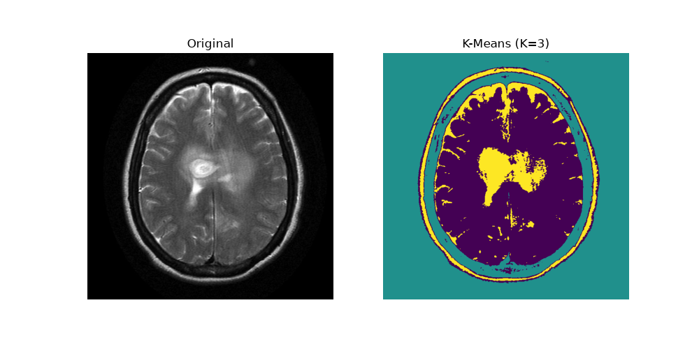

# K-Means MRI Image Segmentation

A Streamlit application for segmenting brain MRI images using the K-Means clustering algorithm.

## 🚀 Live Demo

👉 [Try the K-Means MRI Segmentation App](https://kmeans-mri-zatc9el5orssakzvgzthun.streamlit.app/)

## 💻 GitHub Repository

This project implements MRI image segmentation using K-Means clustering.

## Project Description

This project demonstrates **K-Means clustering for image segmentation**
applied to a brain MRI image.

The goal is to group pixels with similar intensity values into different
clusters and visualize the resulting segmentation. The implementation is
written in Python using OpenCV, NumPy, scikit-learn, and Matplotlib.

> **Note:** This project is an educational image-processing
> demonstration. The segmentation is not intended for medical diagnosis
> or clinical use.

## Objective

The main objectives of this project are to:

-   Apply the K-Means clustering algorithm to an MRI image.
-   Segment the image according to pixel intensity.
-   Visualize the original MRI and the segmented result side by side.
-   Save the segmentation result as a PNG image.
-   Practice using Python libraries for image processing and machine
    learning.

## Technologies Used

-   **Python 3.14**
-   **OpenCV** --- image loading and image processing
-   **NumPy** --- numerical and array operations
-   **scikit-learn** --- K-Means clustering
-   **Matplotlib** --- visualization and saving the result

## How K-Means Works

K-Means is an unsupervised machine learning algorithm that divides data
into a predefined number of clusters.

For this project, each image pixel is treated as a data point based on
its intensity value.

The process is:

1.  Load the MRI image.
2.  Convert the image into a suitable array of pixel values.
3.  Reshape the pixel values so that they can be processed by K-Means.
4.  Choose the number of clusters, **K = 3**.
5.  Initialize three cluster centers.
6.  Assign each pixel to the nearest cluster center.
7.  Recalculate the cluster centers.
8.  Repeat the assignment and update steps until the clusters converge.
9.  Reshape the clustered pixels back into the original image
    dimensions.
10. Display and save the segmented image.

In this example, the three clusters represent groups of pixels with
different intensity levels. The colors in the output are a visualization
of the clusters and should not be interpreted as medical labels.

## Project Structure

``` text
KMeans-MRI/
│
├── brain_mri.jpg
├── segmented_k3.png
├── kmeans.py
├── requirements.txt
├── README.md
└── .gitignore
```

## Installation

### 1. Clone the repository

``` bash
git clone https://github.com/eya2006/KMeans-MRI.git
cd KMeans-MRI
```

### 2. Create a virtual environment

It is recommended to use a virtual environment.

On Windows:

``` powershell
py -3.14 -m venv Venv
```

Activate it:

``` powershell
.\Venv\Scripts\Activate.ps1
```

### 3. Install the required packages

``` powershell
python -m pip install --upgrade pip
python -m pip install -r requirements.txt
```

## How to Run the Project

Make sure the MRI image is available as:

``` text
brain_mri.jpg
```

Then run:

``` powershell
python kmeans.py
```

The program will:

-   Load the MRI image.
-   Apply K-Means clustering with **K = 3**.
-   Display the original and segmented images.
-   Save the output as:

``` text
segmented_k3.png
```

## Example Result

The following image shows the original MRI alongside the result obtained
using K-Means with three clusters.



### Result Interpretation

The left side shows the original MRI image. The right side shows the
image after K-Means segmentation with **K = 3**.

The algorithm separates pixels into three intensity-based groups,
producing distinct regions that make differences in image intensity
easier to visualize.

## Requirements

The required Python packages are listed in `requirements.txt`:

``` text
numpy
opencv-python
scikit-learn
matplotlib
```

## Author

**Eya Ellouze**

GitHub: [@eya2006](https://github.com/eya2006)

## License

This project is intended for educational purposes.
